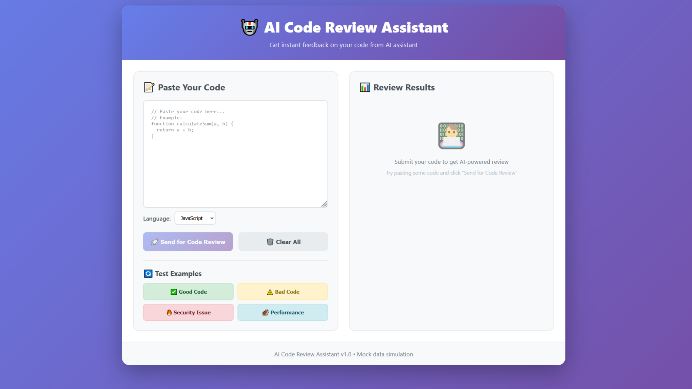

# AI Code Review Assistant

Веб-приложение для имитации анализа кода с использованием  AI-ассистента. Реализован прототип системы для Code Review с визуализацией результатов.

## 🎯 Функциональность

Основные возможности:

* Вставка и анализ кода - пользователь может вставить код на различных языках программирования

* Имитация AI-анализа - система анализирует код и предоставляет детализированный фидбек

* Предопределенные тестовые примеры - 4 категории кода для тестирования разных сценариев

* Визуализация результатов - оценка синтаксиса, безопасности, производительности, стиля

* Адаптивный интерфейс - работает на десктопах и мобильных устройствах

## Интерфейс




## 🚀 Быстрый старт

```sh
npm install
```

### Compile and Hot-Reload for Development

```sh
npm run dev
```

### Compile and Minify for Production

```sh
npm run build
```

### Lint with [ESLint](https://eslint.org/)

```sh
npm run lint
```
